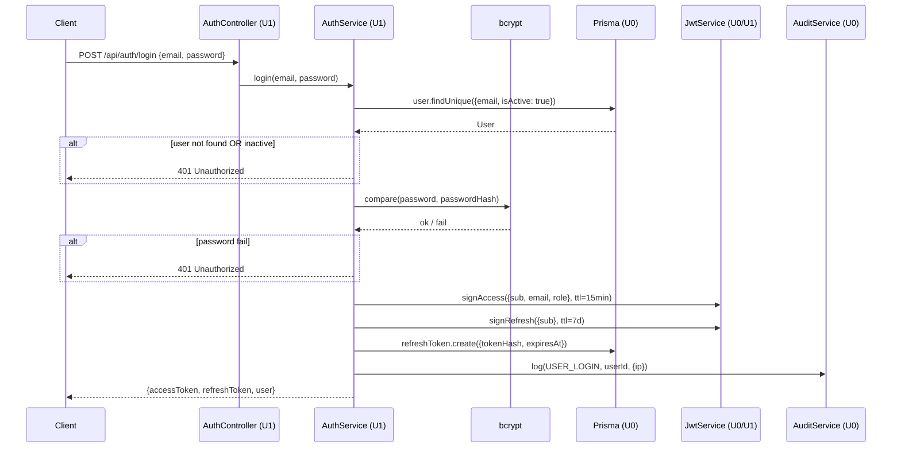
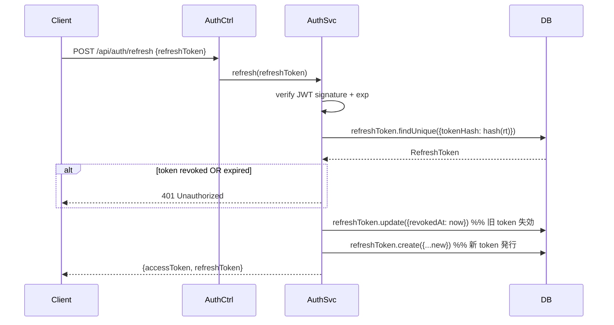
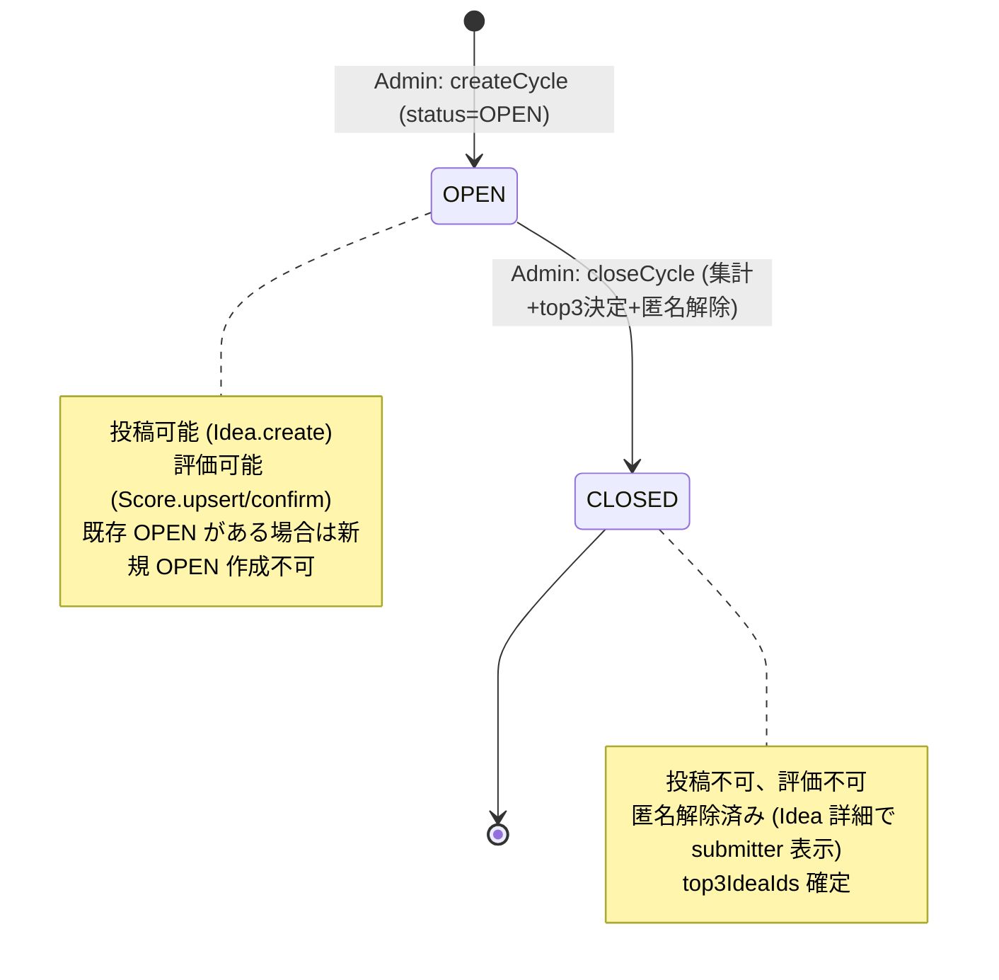
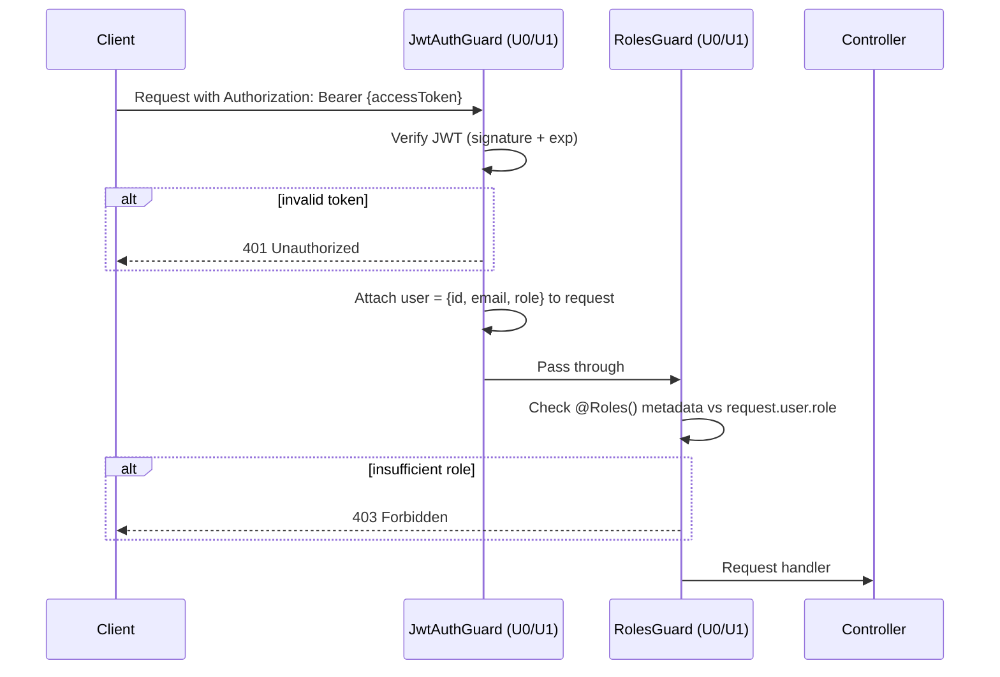

# U0 — Business Logic Model

**Date**: 2026-05-05
**Status**: Generated
**Source**: functional-design-plan Q4 (JWT) / Q9 (集計) / Q11 (SSE) + requirements.md FR-4〜FR-9

このドキュメントは U0 が責任を持つ横断的ビジネスフローを記述します。各ユニットがこの基盤の上で機能を実装します。

---

## 1. 認証フロー（JWT + Refresh Rotation）

### Flow A: ログイン


### Flow B: Access Token Refresh (Rotation)


**Rotation 検出ロジック**: 失効済 RT の再利用を検出した場合、当該ユーザーの全 RT を強制失効（盗まれた疑い）。

### Flow C: ログアウト
```
1. Client が POST /api/auth/logout {refreshToken}
2. AuthService が refreshToken.update({revokedAt: now})
3. Audit: USER_LOGOUT
4. Client 側で localStorage から token 消去
```

### Flow D: パスワードリセット
```
[Request]
1. POST /api/auth/forgot-password {email}
2. PasswordResetToken 生成、tokenHash を DB 保存、TTL 24h
3. ユーザーへ「リセットリンク」メール送信（PoC: コンソールログ出力 or メール SMTP）
   → リンク: /auth/reset-password?token={raw}
4. Audit: PASSWORD_RESET_REQUEST

[Complete]
5. POST /api/auth/reset-password {token, newPassword}
6. tokenHash で検索、expiresAt > now、usedAt IS NULL を確認
7. user.passwordHash 更新
8. PasswordResetToken.usedAt = now
9. 当該ユーザーの全 RefreshToken を失効
10. Audit: PASSWORD_RESET_COMPLETE
```

---

## 2. Cycle ライフサイクル（U6 主体、U0 が状態モデル提供）



**Cycle CLOSE トランザクション (US-031, US-032, US-033)**:
```
$transaction:
    1. cycleId の OPEN 状態を確認 → CLOSED ならエラー
    2. 当該 Cycle の Score (status=CONFIRMED) を集計
       - 各 Idea ごとの平均スコア計算
       - feasibility_avg, impact_avg, innovation_avg, total_avg
    3. Idea を total_avg 降順 + 同点時 createdAt 昇順でランキング
    4. 上位 3 Idea を top3IdeaIds JSON に保存
    5. cycle.status = CLOSED, closedAt = now()
    6. （匿名解除はスキーマ変更不要、API レスポンスから submitterId を返すように制御）
    7. Audit: CYCLE_CLOSE {top3IdeaIds, byUserId}
    8. SSE publish: cycle.closed
```

---

## 3. スコア集計ロジック（FR-6）

### 平均スコア計算
```
INPUT: cycleId, ideaId
OUTPUT: { feasibility_avg, impact_avg, innovation_avg, total_avg, completion: "N/M" }

confirmed_scores = Score.findMany({
    where: { ideaId, cycleId, status: CONFIRMED }
})
panel_total = User.count({ where: { role: PANEL, isActive: true } })
panel_confirmed = confirmed_scores.length

if panel_confirmed == 0:
    return { feasibility_avg: 0, impact_avg: 0, innovation_avg: 0, total_avg: 0, completion: "0/" + panel_total }

feasibility_avg = round(sum(s.feasibility) / panel_confirmed, 2)
impact_avg      = round(sum(s.impact) / panel_confirmed, 2)
innovation_avg  = round(sum(s.innovation) / panel_confirmed, 2)
total_avg       = round((feasibility_avg + impact_avg + innovation_avg) / 3, 2)
total_sum       = round(feasibility_avg + impact_avg + innovation_avg, 2)

return {
    feasibility_avg,
    impact_avg,
    innovation_avg,
    total_avg,           // 3軸平均
    total_sum,           // 3軸合計（FR-6.1: UI で両表示）
    completion: panel_confirmed + "/" + panel_total
}
```

**ルール**:
- 小数点以下 **2 桁** で丸め（FR-6.1）
- DRAFT スコアは集計対象外
- 集計対象パネル数 = `User.role=PANEL AND isActive=true` 全員
- 確定済 0 件のアイデアは total_avg=0 で末尾扱い（Q9）

### 上位 3 決定 (US-032)
```
INPUT: cycleId
OUTPUT: top3IdeaIds[]

ideas = Idea.findMany({
    where: { cycleId, status: PUBLISHED }
})

ranked = ideas.map(i => ({
    ideaId: i.id,
    total_sum: aggregate(i.id, cycleId).total_sum,
    createdAt: i.createdAt
})).sort((a, b) => {
    if (a.total_sum !== b.total_sum) return b.total_sum - a.total_sum  // 降順
    return a.createdAt - b.createdAt                                    // 同点は昇順
})

top3 = ranked.slice(0, 3).map((r, idx) => ({
    rank: idx + 1,
    ideaId: r.ideaId
}))
```

---

## 4. SSE Pub/Sub フロー

### Publisher 側（各ユニット）
```typescript
// 例: U2 IdeasService 内
async publish(ideaId: string) {
    await this.prisma.idea.update({...})
    this.sseHub.publish('idea.published', { ideaId, cycleId, publishedAt })
    return idea
}
```

### Subscriber 側（U0 SseHubModule）
```
GET /api/events?topics=idea.published,score.confirmed,cycle.closed,idea.deleted

接続フロー:
1. JWT 認証 (Cookie or Authorization header or query param)
2. ロール条件: ADMIN は全イベント, PANEL は score.confirmed のうち自分のもののみ, SUBMITTER は自分の idea.deleted のみ
3. EventSource 接続維持
4. 15秒ごと heartbeat (`: ping\n\n`)
5. イベント発生時: `event: idea.published\ndata: {...}\n\n`
6. クライアント切断 → サーバー側で subscriber を削除
```

### イベント別ペイロード（要約、詳細は domain-entities.md と整合）

| Event | Payload (JSON) | 配信制限 |
|---|---|---|
| `idea.published` | `{ ideaId, cycleId, publishedAt, title }` | 全認証ユーザー |
| `score.confirmed` | `{ ideaId, cycleId }` | ADMIN のみ（FR-5.1: 評価期間中の他パネルスコア非公開） |
| `cycle.closed` | `{ cycleId, closedAt, top3: [{rank, ideaId, title, submitterName}, ...] }` | 全認証ユーザー（公開イベント） |
| `idea.deleted` | `{ ideaId, cycleId, reason: <admin only> }` | reason は ADMIN のみ受信、他は理由なし |

---

## 5. バリデーション横断パターン

### 入力バリデーション層
```
1. Controller @Body() で DTO クラスを受け取る
2. ValidationPipe (グローバル) が class-validator デコレーターを適用
3. 違反時: BadRequestException → HttpExceptionFilter (U0) が統一形式に変換
```

### 共通 DTO Base (U0 提供)
```typescript
// shared/common/dto/pagination.dto.ts
export class PaginationDto {
    @IsOptional() @IsInt() @Min(1) page?: number = 1
    @IsOptional() @IsInt() @Min(1) @Max(100) limit?: number = 20
}

// shared/common/dto/error-response.dto.ts
export class ErrorResponseDto {
    statusCode: number
    error: string
    message: string | string[]
    code: string
    timestamp: string
    path: string
}
```

### 共通 Exception Filter (U0)
```typescript
@Catch()
export class GlobalExceptionFilter implements ExceptionFilter {
    catch(exception, host) {
        // HttpException → そのまま整形
        // PrismaClientKnownRequestError → 適切な HTTP 変換
        //   P2002 (unique constraint) → 409 Conflict
        //   P2025 (record not found) → 404 Not Found
        // その他 → 500 Internal Server Error
        // ログ出力 + 統一形式レスポンス
    }
}
```

---

## 6. 認可フロー（JwtAuthGuard / RolesGuard）



**使用例**:
```typescript
@UseGuards(JwtAuthGuard, RolesGuard)
@Roles(UserRole.ADMIN)
@Post('cycles')
async createCycle(@Body() dto: CreateCycleDto, @Req() req) {...}
```

---

## 7. ファイルアップロード処理（U2 が利用、U0 が基盤提供）

```
1. POST /api/ideas/{id}/attachments (multipart/form-data)
2. Multer (memoryStorage) で in-memory にバッファ
3. Validation:
   - mimeType in {image/png, image/jpeg}
   - sizeBytes <= 5MB
   - 当該 Idea の attachment 数 + 1 <= 5
4. ファイル保存先決定: uploads/{ideaId}/{cuid}-{filename}
5. Buffer を fs.writeFile で書き込み
6. IdeaAttachment.create({...})
7. Response: IdeaAttachment 情報
```

**返却**: `GET /api/ideas/{id}/attachments/{attachmentId}` で `Express.static('uploads')` 経由で配信。認証必須（このルートも JwtAuthGuard 適用）。

---

## 8. ヘルスチェック（@nestjs/terminus）

```typescript
// shared/health/health.controller.ts
@Controller('health')
export class HealthController {
    @Get()  // 軽量、起動確認のみ
    liveness() { return { status: 'ok' } }

    @Get('db')  // DB 接続確認
    @HealthCheck()
    db() { return this.prismaIndicator.isHealthy('db') }

    @Get('ready')  // 全依存
    @HealthCheck()
    ready() { return [() => this.prismaIndicator.isHealthy('db')] }
}
```
