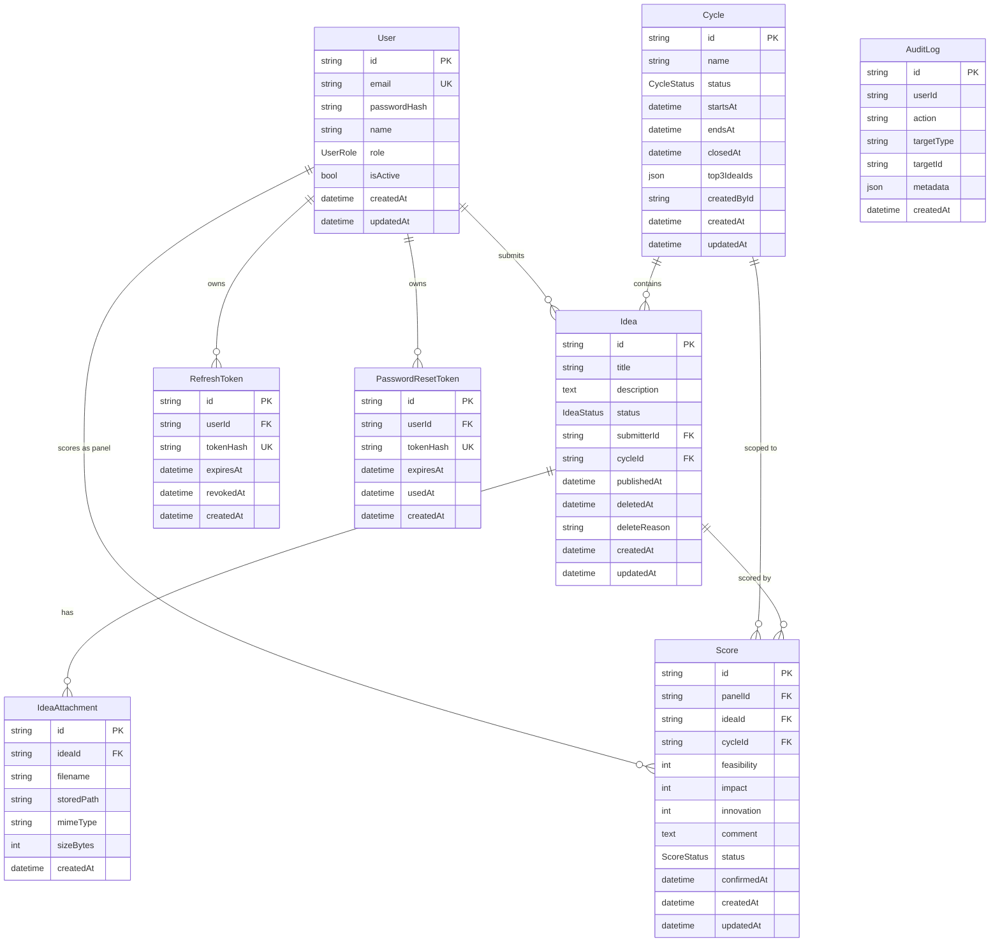

# U0 — Domain Entities

**Date**: 2026-05-05
**Status**: Generated
**Source**: functional-design-plan Q1〜Q9 / Q11

このドキュメントは Prisma Schema 全体（全ユニット共有）を定義します。U0 が schema.prisma 全体をオーナーします。

---

## 1. ER 図



---

## 2. Prisma Schema (full)

```prisma
// prisma/schema.prisma
// Owner: U0 Shared Foundation

generator client {
  provider = "prisma-client-js"
}

datasource db {
  provider = "mysql"
  url      = env("DATABASE_URL")
}

// =========================
// 認証 / ユーザー (U1)
// =========================

model User {
  id              String   @id @default(cuid())
  email           String   @unique
  passwordHash    String
  name            String
  role            UserRole @default(SUBMITTER)
  isActive        Boolean  @default(true)
  createdAt       DateTime @default(now())
  updatedAt       DateTime @updatedAt

  ideas           Idea[]
  scores          Score[]                @relation("PanelScores")
  refreshTokens   RefreshToken[]
  passwordResets  PasswordResetToken[]

  @@index([role, isActive])
  @@index([email])
}

enum UserRole {
  SUBMITTER
  PANEL
  ADMIN
}

model RefreshToken {
  id          String    @id @default(cuid())
  userId      String
  tokenHash   String    @unique
  expiresAt   DateTime
  revokedAt   DateTime?
  createdAt   DateTime  @default(now())

  user        User      @relation(fields: [userId], references: [id], onDelete: Cascade)

  @@index([userId])
  @@index([expiresAt])
}

model PasswordResetToken {
  id          String    @id @default(cuid())
  userId      String
  tokenHash   String    @unique
  expiresAt   DateTime
  usedAt      DateTime?
  createdAt   DateTime  @default(now())

  user        User      @relation(fields: [userId], references: [id], onDelete: Cascade)

  @@index([userId])
}

// =========================
// 評価サイクル (U6)
// =========================

model Cycle {
  id           String      @id @default(cuid())
  name         String      @db.VarChar(200)
  status       CycleStatus @default(OPEN)
  startsAt     DateTime
  endsAt       DateTime
  closedAt     DateTime?
  top3IdeaIds  Json?
  createdById  String
  createdAt    DateTime    @default(now())
  updatedAt    DateTime    @updatedAt

  ideas        Idea[]
  scores       Score[]

  @@index([status])
  @@index([endsAt])
}

enum CycleStatus {
  OPEN
  CLOSED
}

// =========================
// アイデア (U2)
// =========================

model Idea {
  id           String     @id @default(cuid())
  title        String     @db.VarChar(120)
  description  String     @db.Text
  status       IdeaStatus @default(DRAFT)
  submitterId  String
  cycleId      String
  publishedAt  DateTime?
  deletedAt    DateTime?
  deleteReason String?    @db.VarChar(500)
  createdAt   DateTime    @default(now())
  updatedAt   DateTime    @updatedAt

  submitter    User             @relation(fields: [submitterId], references: [id])
  cycle        Cycle            @relation(fields: [cycleId], references: [id])
  attachments  IdeaAttachment[]
  scores       Score[]

  @@index([cycleId, status])
  @@index([submitterId])
  @@index([status, publishedAt])
}

enum IdeaStatus {
  DRAFT
  PUBLISHED
  DELETED
}

model IdeaAttachment {
  id          String   @id @default(cuid())
  ideaId      String
  filename    String   @db.VarChar(255)
  storedPath  String   @db.VarChar(500)
  mimeType    String   @db.VarChar(50)
  sizeBytes   Int
  createdAt   DateTime @default(now())

  idea        Idea     @relation(fields: [ideaId], references: [id], onDelete: Cascade)

  @@index([ideaId])
}

// =========================
// スコア (U3)
// =========================

model Score {
  id           String      @id @default(cuid())
  panelId      String
  ideaId       String
  cycleId      String
  feasibility  Int         @db.SmallInt
  impact       Int         @db.SmallInt
  innovation   Int         @db.SmallInt
  comment      String?     @db.Text
  status       ScoreStatus @default(DRAFT)
  confirmedAt  DateTime?
  createdAt    DateTime    @default(now())
  updatedAt    DateTime    @updatedAt

  panel        User        @relation("PanelScores", fields: [panelId], references: [id])
  idea         Idea        @relation(fields: [ideaId], references: [id])
  cycle        Cycle       @relation(fields: [cycleId], references: [id])

  @@unique([panelId, ideaId])
  @@index([cycleId, status])
  @@index([ideaId])
  @@index([panelId, cycleId])
}

enum ScoreStatus {
  DRAFT
  CONFIRMED
}

// =========================
// 監査ログ (U0 Cross-cutting)
// =========================

model AuditLog {
  id          String   @id @default(cuid())
  userId      String?
  action      String   @db.VarChar(50)
  targetType  String?  @db.VarChar(50)
  targetId    String?  @db.VarChar(50)
  metadata    Json?
  createdAt   DateTime @default(now())

  @@index([userId, createdAt])
  @@index([action, createdAt])
  @@index([targetType, targetId])
}
```

---

## 3. フィールド詳細・制約

### User
| Field | Type | 制約 | 備考 |
|---|---|---|---|
| email | String | UNIQUE / RFC5322 形式 / 小文字統一 | アプリ側で `email.toLowerCase()` してから DB |
| passwordHash | String | bcrypt cost=10 | 平文 password は DB に絶対保存しない |
| name | String | 1〜50 文字 | 表彰殿堂で表示する氏名 |
| role | UserRole | enum | DEFAULT=SUBMITTER, Admin が変更 |
| isActive | Boolean | DEFAULT=true | false で論理削除（ログイン不可、Read は可） |

### Cycle
| Field | 制約 |
|---|---|
| name | 1〜200 文字 |
| startsAt < endsAt | アプリ側でバリデーション |
| status=OPEN は同時 1 つ | 新規 OPEN 作成時に他 OPEN を CLOSED に強制 OR 拒否（Q9 補足: 拒否） |
| closedAt | CLOSED 移行時のみ NOT NULL |
| top3IdeaIds | CLOSED 移行時のみ NOT NULL、JSON: `[{rank:1,ideaId:"..."}, {rank:2,...}, {rank:3,...}]` |

### Idea
| Field | 制約 |
|---|---|
| title | 1〜120 文字、空白のみ NG |
| description | 1〜5000 文字 |
| status | DRAFT → PUBLISHED は不可逆（再 DRAFT 化なし） |
| publishedAt | PUBLISHED 移行時のみ NOT NULL |
| deletedAt | DELETED 移行時のみ NOT NULL |
| 添付数 | 0〜5 個 (アプリ側) |

### IdeaAttachment
| Field | 制約 |
|---|---|
| mimeType | `image/png` / `image/jpeg` のみ許可（アプリ側） |
| sizeBytes | ≤ 5,242,880 (5MB) |
| storedPath | `uploads/{ideaId}/{cuid}-{filename}` 形式 |

### Score
| Field | 制約 |
|---|---|
| feasibility / impact / innovation | 1〜5 整数（アプリ側 + DB SmallInt） |
| `(panelId, ideaId)` UNIQUE | 1 パネル × 1 アイデア = 1 スコア |
| status DRAFT → CONFIRMED は確定操作 | CONFIRMED → DRAFT は不可（FR-4.6 と整合: 確定操作で締め切る） |
| confirmedAt | CONFIRMED 移行時のみ NOT NULL |
| Cycle.status=CLOSED 後の Score 変更不可 | Service 層でチェック |

### AuditLog
| Field | 制約 |
|---|---|
| action | 列挙値文字列（後述の actions 一覧参照） |
| metadata | JSON、構造はアクション別（例: ROLE_CHANGE は `{from: "SUBMITTER", to: "PANEL"}`） |

---

## 4. AuditLog アクション一覧

| Action | 発火元 | targetType | metadata 例 |
|---|---|---|---|
| `USER_LOGIN` | U1 | User | `{ip: "127.0.0.1", userAgent: "..."}` |
| `USER_LOGOUT` | U1 | User | `{}` |
| `PASSWORD_RESET_REQUEST` | U1 | User | `{}` |
| `PASSWORD_RESET_COMPLETE` | U1 | User | `{}` |
| `ROLE_CHANGE` | U6 | User | `{from, to, byUserId}` |
| `IDEA_PUBLISH` | U2 | Idea | `{cycleId, title}` |
| `IDEA_DELETE` | U6 | Idea | `{reason, byUserId}` |
| `SCORE_CONFIRM` | U3 | Score | `{ideaId, cycleId}` |
| `CYCLE_CREATE` | U6 | Cycle | `{name, startsAt, endsAt}` |
| `CYCLE_CLOSE` | U6 | Cycle | `{closedAt, top3IdeaIds, byUserId}` |

---

## 5. インデックス戦略

| テーブル | インデックス | 用途 |
|---|---|---|
| User | (email) | ログイン |
| User | (role, isActive) | パネル一覧 / 管理者一覧 |
| Idea | (cycleId, status) | 評価対象一覧 / Cycle 別表示 |
| Idea | (submitterId) | 自分の投稿一覧 |
| Idea | (status, publishedAt) | リーダーボード（PUBLISHED 降順） |
| Score | (panelId, ideaId) UNIQUE | 1 パネル × 1 アイデア制約 |
| Score | (cycleId, status) | Cycle 別 / CONFIRMED 集計 |
| Score | (ideaId) | アイデア詳細時の集計 |
| Cycle | (status) | OPEN な Cycle 検索 |
| AuditLog | (userId, createdAt) | ユーザー別監査追跡 |
| AuditLog | (action, createdAt) | アクション別検索 |

---

## 6. データ整合性ルール

1. **論理削除優先**: User.isActive=false / Idea.status=DELETED は物理削除しない（履歴保持）
2. **カスケード削除の境界**:
   - `User → RefreshToken/PasswordResetToken` は CASCADE（依存ライフサイクル）
   - `Idea → IdeaAttachment` は CASCADE（添付は親に従属）
   - `User → Idea` は SET NULL や CASCADE せず、ON DELETE RESTRICT 相当（実運用で User 物理削除しないため）
3. **Cycle 終了後の不変性**: `cycle.status=CLOSED` 後は紐付く Idea/Score の変更を Service 層で拒否
4. **匿名性の DB レベル保持**: `Idea.submitterId` は常に DB に保持。匿名化は API レスポンスから `submitterId` を除外することで実現
