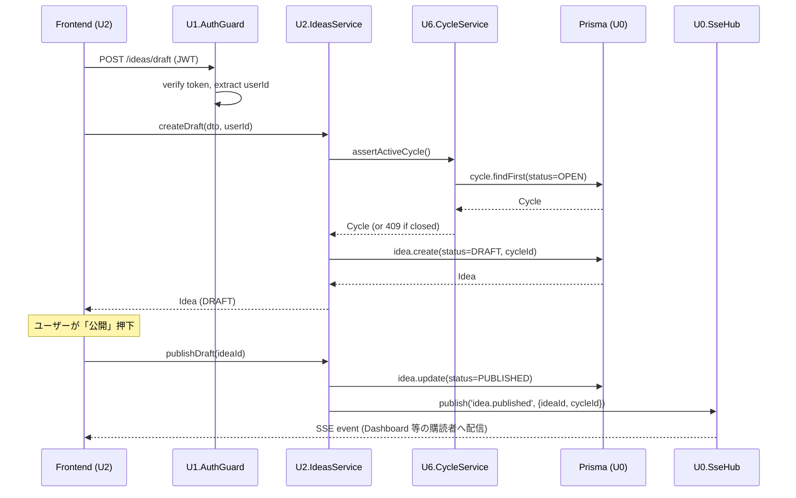
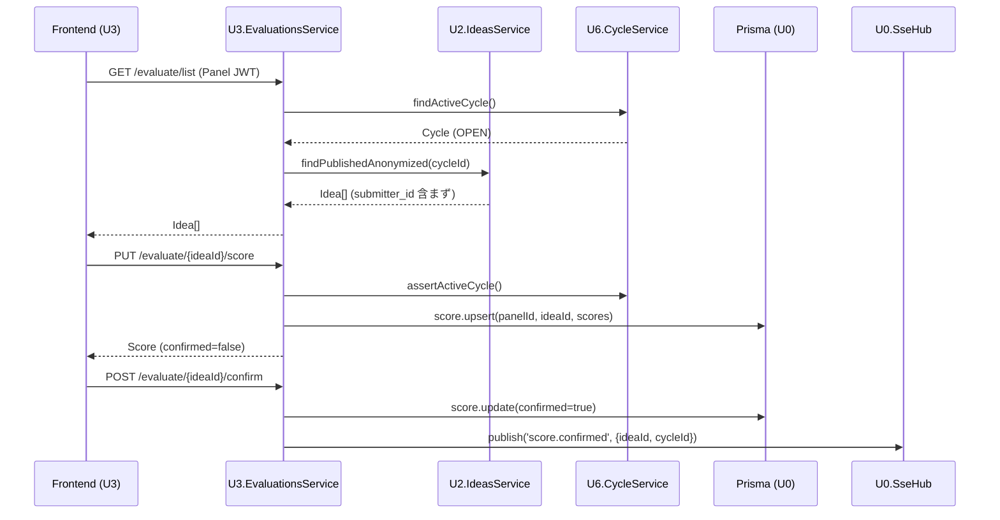
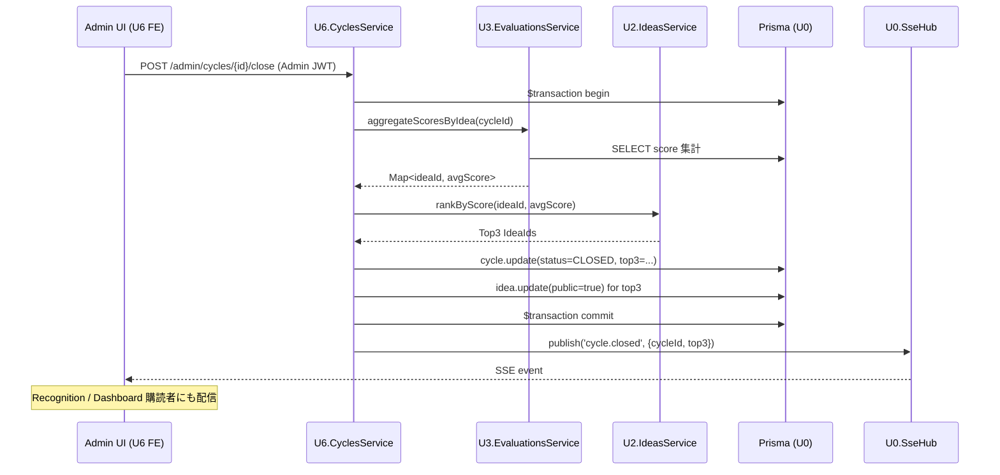

# Unit of Work — Dependency Matrix & Communication Patterns

**Date**: 2026-05-05
**Status**: Generated (PART 2)
**Source**: `unit-of-work.md` + `application-design.md` + Q1=A / Q4=B / Q6=A / Q7=C

---

## 1. ユニット間依存マトリックス

行 = 依存元（呼び出す側）、列 = 依存先（呼び出される側）。`✓` = 直接依存、`-` = 依存なし。

| From \ To | U0 | U1 | U2 | U3 | U4 | U5 | U6 |
|-----------|----|----|----|----|----|----|-----|
| **U0** Shared | — | - | - | - | - | - | - |
| **U1** Auth | ✓ | — | - | - | - | - | - |
| **U2** Submit | ✓ | ✓ | — | - | - | - | ✓ |
| **U3** Eval | ✓ | ✓ | ✓ | — | - | - | ✓ |
| **U4** Dashboard | ✓ | ✓ | ✓ | ✓ | — | - | ✓ |
| **U5** Recognition | ✓ | ✓ | ✓ | - | - | — | ✓ |
| **U6** Admin/Cycles | ✓ | ✓ | ✓ | ✓ | - | - | — |

**観察**:
- U0 は完全に独立（誰にも依存しない）
- U1 は U0 にのみ依存（最小依存）
- U6 は Cycle 集計時に U2 (Idea), U3 (Score) を読み出す必要あり
- U4 は最も依存が多い（読み取りビュー集約）
- U5 は U3 (Score) を直接呼ばず U6 (確定済み Cycle) 経由のみ

---

## 2. 通信パターン（Q1=A モノリス + Q6=A）

### パターン A: Shared Module Injection（U0 → 他全ユニット）
- U0 のサービス（PrismaService / SseHub / Logger / Audit / Common Guard）は NestJS の `@Global()` Module として export
- 他ユニットは constructor injection で利用
- 例: `constructor(private prisma: PrismaService) {}`

### パターン B: Service-to-Service（クロスユニット）
- 他ユニットの **Service** を constructor injection で呼び出す
- **Repository を直接呼ばない**（カプセル化を保つ）
- 例: `EvaluationsService` が `IdeasService.findByIdAnonymized()` を呼ぶ
- NestJS の Module 機能で `exports: [IdeasService]` 宣言済み Service のみ呼び出し可

### パターン C: Cycle Service の薄い API
- U6 の `CycleService` は他ユニットから頻繁に参照されるため、薄く再利用しやすい API を公開
  - `findActiveCycle(): Promise<Cycle | null>` — 現在 OPEN な Cycle
  - `assertActiveCycle(): Promise<Cycle>` — OPEN でなければ Exception
  - `findById(cycleId): Promise<Cycle>` — Cycle 詳細
- 全ユニットが U6 に依存することの正当化（Cycle はドメインの中心概念）

### パターン D: SSE Pub/Sub（U0 SSE Hub 経由）
- 各ユニットが「自分の領域でイベントが起きた」ことを **U0 の SSE Hub に publish**
- 購読側ユニット（主に U4 Dashboard、U5 Recognition）が SSE で配信
- ユニット間の直接結合を避ける（pub/sub 疎結合）
- イベント型例:
  - `idea.published` (publisher: U2, subscriber: U4)
  - `score.confirmed` (publisher: U3, subscriber: U4)
  - `cycle.closed` (publisher: U6, subscriber: U4 / U5)

### パターン E: 共有 Prisma Schema（Q6=A）
- 全ユニットが同じ MySQL DB と同じ `schema.prisma` を共有
- ただし「自分のテーブル」を Repository 経由でのみ Write
- 他ユニットのテーブルは Service 経由で Read（直接 SQL や直接 Prisma 呼び出しを避ける）

---

## 3. データフロー（実装順序と整合）

### Flow 1: 新規アイデア投稿（U2 主導）



### Flow 2: 評価入力（U3 主導）



### Flow 3: Cycle 終了処理（U6 主導 — 集計とトランザクション）



---

## 4. 依存違反の禁止ルール

以下のパターンは **禁止** — 各ユニット境界の規律を保つ:

| 違反 | 説明 | 代替 |
|---|---|---|
| 他ユニットの Repository 直接呼び出し | `EvaluationsService` が `IdeasRepository` を呼ぶ | `IdeasService` 経由で呼ぶ |
| 他ユニットのテーブルへの直接 Write | `EvaluationsService` が `idea.update()` する | Idea 更新は `IdeasService.markAsPublic()` 等を呼ぶ |
| U0 が他ユニットに依存 | `SseHub` が `IdeasService` を import | U0 は完全独立、他ユニットが U0 を import |
| 循環依存 | U2 ↔ U3 の相互依存 | 共通の依存先 (U6/U0) を介す or イベント駆動 |
| Frontend で複数ユニットの API を直接 fetch | Component 内で 4-5 個の API 直叩き | 共通 hooks (`useIdea`, `useScore` 等) で抽象化、各ユニットの hook がその API を担当 |

---

## 5. 実装順序の依存的根拠（Q7=C）

各ユニット実装開始時に「依存先が完成済み」であることを保証:

| 実装順 | ユニット | 依存先 | 依存先の状態 |
|---|---|---|---|
| 1 | U0 | なし | — |
| 2 | U1 | U0 | ✅ 完成済み |
| 3 | U6 | U0, U1 | ✅ 完成済み |
| 4 | U2 | U0, U1, U6 | ✅ 完成済み |
| 5 | U3 | U0, U1, U2, U6 | ✅ 完成済み |
| 6 | U4 | U0, U1, U2, U3, U6 | ✅ 完成済み |
| 7 | U5 | U0, U1, U2, U6 | ✅ 完成済み |

**循環依存なし、後方依存なし**（各ユニットは自分より前に実装されたユニットにのみ依存）。

---

## 6. NestJS Module Import 図（実装ガイド）

```
AppModule
  ├─ SharedModule (U0, @Global)
  │   ├─ PrismaModule
  │   ├─ CommonModule
  │   ├─ LoggerModule
  │   ├─ AuditModule
  │   ├─ SseHubModule
  │   └─ HealthModule
  ├─ AuthModule (U1)         ── exports: AuthService, JwtStrategy, AuthGuard
  ├─ UsersModule (U1)        ── exports: UsersService
  ├─ CyclesModule (U6)       ── exports: CyclesService
  ├─ AdminModule (U6)        ── imports: CyclesModule, UsersModule, IdeasModule, EvaluationsModule
  ├─ IdeasModule (U2)        ── imports: CyclesModule, UsersModule ; exports: IdeasService
  ├─ EvaluationsModule (U3)  ── imports: CyclesModule, IdeasModule ; exports: EvaluationsService
  ├─ DashboardModule (U4)    ── imports: IdeasModule, EvaluationsModule, CyclesModule
  └─ RecognitionModule (U5)  ── imports: IdeasModule, CyclesModule
```

各 Module は **依存先の Module を import** し、**自身の Service を exports** することで他ユニットから利用可能にする。
