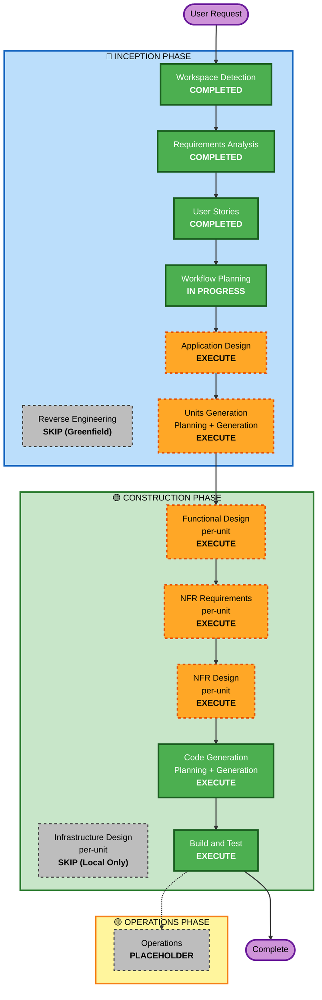

# Execution Plan — Ideation Portal

**Date**: 2026-05-03
**Status**: Awaiting Approval

---

## Detailed Analysis Summary

### Change Impact Assessment
- **User-facing changes**: ✅ Yes — 全機能が新規 UI（投稿/評価/ダッシュボード/表彰/管理）
- **Structural changes**: ✅ Yes — Greenfield のため全アーキテクチャを新規設計
- **Data model changes**: ✅ Yes — User / Idea / Score / Cycle / Comment 等の新規スキーマ
- **API changes**: ✅ Yes — 認証/投稿/評価/ダッシュボード/管理の新規 REST API
- **NFR impact**: ⚠️ Medium — 100同時接続、準リアルタイム反映、独立評価のための認可制御

### Risk Assessment
- **Risk Level**: **Low** — ローカル開発のみ、規模 〜100名、業務クリティカル度低、ロールバック容易
- **Rollback Complexity**: Easy — ローカル環境、Git でロールバック可能、本番依存なし
- **Testing Complexity**: Moderate — 6 Epic × 41 stories の AC をカバーするテスト戦略が必要

---

## Workflow Visualization



### Text Alternative

```
🔵 INCEPTION:
  - Workspace Detection         [COMPLETED]
  - Reverse Engineering         [SKIP - Greenfield]
  - Requirements Analysis       [COMPLETED]
  - User Stories                [COMPLETED]
  - Workflow Planning           [IN PROGRESS]
  - Application Design          [EXECUTE]
  - Units Generation            [EXECUTE]

🟢 CONSTRUCTION (Per-Unit Loop, then Build & Test):
  - Functional Design           [EXECUTE per-unit]
  - NFR Requirements            [EXECUTE per-unit]
  - NFR Design                  [EXECUTE per-unit]
  - Infrastructure Design       [SKIP - ローカルのみ]
  - Code Generation             [EXECUTE per-unit, ALWAYS]
  - Build and Test              [EXECUTE, ALWAYS]

🟡 OPERATIONS:
  - Operations                  [PLACEHOLDER]
```

---

## Phases to Execute

### 🔵 INCEPTION PHASE
- [x] Workspace Detection (COMPLETED)
- [x] Reverse Engineering (SKIPPED — greenfield, 既存コードなし)
- [x] Requirements Analysis (COMPLETED)
- [x] User Stories (COMPLETED)
- [x] Workflow Planning (IN PROGRESS — このドキュメント生成中)
- [ ] **Application Design — EXECUTE**
  - **Rationale**: Greenfield で 6 Epic の機能領域があり、コンポーネント (Auth / Idea / Evaluation / Dashboard / Recognition / Admin) と各層 (Controller / Service / Repository) のサービスレイヤ設計、コンポーネント間依存の明確化が必要。
- [ ] **Units Generation — EXECUTE**
  - **Rationale**: 41 stories を実装単位 (Unit of Work) に分割し、依存関係と並行実装可能性を整理する必要がある。Auth / Submission / Evaluation / Dashboard / Recognition / Admin の6ユニットへの分解が自然。

### 🟢 CONSTRUCTION PHASE
- [ ] **Functional Design — EXECUTE (per-unit)**
  - **Rationale**: 業務ロジック（匿名化解除タイミング、独立評価制御、3軸スコア集計、上位3決定/同点処理、サイクル管理）を unit 単位で詳細設計する必要あり。
- [ ] **NFR Requirements — EXECUTE (per-unit)**
  - **Rationale**: 100同時接続・準リアルタイム反映・認可制御 (FR-5 独立性) など unit ごとに NFR 要件が異なる。各 unit で必要な NFR を明確化。
- [ ] **NFR Design — EXECUTE (per-unit)**
  - **Rationale**: NFR Requirements の結果に対して、認証/認可パターン (RBAC + ガード)、SSE/ポーリング設計、楽観ロック等を組み込む。
- [ ] **Infrastructure Design — SKIP**
  - **Rationale**: 本要件では「一旦ローカルでやります」(G4) のため本番インフラ設計は範囲外。Code Generation 内で **最小限の Docker Compose 構成（MySQL + アプリ）** を扱う。本番デプロイは将来課題。
- [ ] **Code Generation — EXECUTE (per-unit, ALWAYS)**
  - **Rationale**: コードと付随テストを生成。
- [ ] **Build and Test — EXECUTE (ALWAYS)**
  - **Rationale**: 全ユニットの統合ビルド + 単体/統合/E2E テスト。

### 🟡 OPERATIONS PHASE
- [ ] **Operations — PLACEHOLDER**
  - **Rationale**: 本番デプロイ・監視・運用は将来課題（範囲外）。

---

## Recommended Unit Decomposition (Units Generation で詳細化)

| Unit ID | 名前 | 主担当 Epic | 概略 | 並行性 |
|---|---|---|---|---|
| U1 | Auth & Roles | EP-AUTH | 登録/ログイン/RBAC/パネル任命 | 他ユニットに先行（基盤） |
| U2 | Idea Submission | EP-SUBMIT | 投稿・ドラフト・画像添付 | U1 完了後に並行可 |
| U3 | Evaluation | EP-EVAL | 評価ダッシュボード・スコア・独立性 | U1 + U2 完了後 |
| U4 | Dashboard & Analytics | EP-DASH | リーダーボード・SSE/ポーリング・ディメンション比較 | U1〜U3 完了後 |
| U5 | Recognition | EP-REC | サイクル終了・上位3確定・氏名公開・殿堂 | U3 + U4 完了後 |
| U6 | Admin | EP-ADMIN | サイクル管理・パネル管理・削除・メトリクス | U1〜U5 と並行可（一部依存） |

**実装順序の推奨**: U1 → U2 → U3 → U4 → U5 → U6（Sequential）。ただし U6 の一部は U1 完了後すぐ着手可能。

---

## Estimated Timeline

| Phase | 想定期間（人日） | 備考 |
|---|---|---|
| INCEPTION 残（App Design + Units） | 0.5〜1日 | AI 主導 |
| CONSTRUCTION (Per-Unit Loop × 6) | 6〜12日 | unit 平均 1〜2日 (Functional + NFR + Code) |
| Build and Test | 1〜2日 | 統合テスト含む |
| **合計** | **約 8〜15日（AI 駆動 MVP）** | ローカル動作の MVP まで |

※ AI 駆動の生成と人間レビューの組み合わせの想定。実時間は GAN/レビュー回数に依存。

---

## Success Criteria

- **Primary Goal**: 〜100名規模の社内アイデアポータルがローカル動作し、41 stories のうち全 Must (26) と多くの Should (11) が実装される MVP の完成
- **Key Deliverables**:
  - Next.js + TypeScript フロントエンド（Submitter / Panel / Admin の各画面）
  - NestJS + TypeScript バックエンド（REST API + SSE/ポーリング）
  - MySQL スキーマ + 最小限の seed データ
  - Docker Compose によるワンコマンド起動
  - 単体テスト（カバレッジ 80%）+ 主要シナリオの統合テスト
- **Quality Gates**:
  - 全 Must ストーリーの AC が PASS
  - 認可テスト（パネル独立性 FR-5、匿名化 FR-3）が PASS
  - リーダーボード反映遅延 30秒以内
  - TypeScript strict モードでエラーなし
